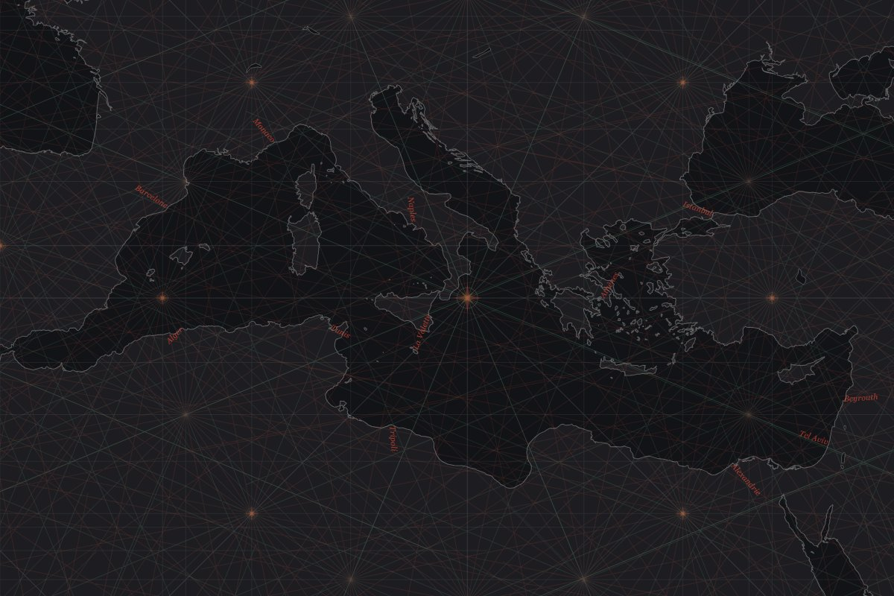

# Carte portulan

[](https://github.com/lenavarque/carte-portulan/actions/workflows/tests.yml)
[](LICENSE)


Dessine une carte du monde à la manière des portulans, les cartes marines de la fin du Moyen Âge : côtes, noms des
ports écrits perpendiculairement au rivage, réseaux de lignes de rhumb et roses des vents. La carte est un fichier SVG
dont les couleurs se règlent en CSS, pensé pour servir de fond à une page web.

C'est le fond du site [Le Portulan](https://leportulan.fr).



*[English summary below.](#in-english)*

## Ce que contient la carte

- **Les terres et les côtes**, d'après [Natural Earth](https://www.naturalearthdata.com/) : côtes détaillées (1/10 000 000)
  autour de la Méditerranée et de l'Europe, moyennes (1/50 000 000) ailleurs, et les grands lacs.
- **Les noms des ports**, écrits comme sur les portulans : perpendiculaires à la côte, vers l'intérieur des terres.
  Les plus importants (grandes villes et capitales) sont dans une couleur à part, le rouge sur les portulans.
- **Les réseaux de rhumbs** : autour d'une rose centrale, 16 roses sur un cercle, et de chacune partent les 32 vents,
  en trois encres (vents principaux, demi-vents, quarts de vent).
- **Les roses des vents** : des petites aux nœuds du réseau, et de grandes roses ornées (fleur de lys au nord, croix
  au levant, initiales des vents méditerranéens).

La projection est celle de Mercator : les lignes de rhumb, routes à cap constant, y sont droites, comme sur les
portulans.

## Installation

Il faut Python 3.10 ou plus récent, et rien d'autre : le programme n'utilise que la bibliothèque standard.

```bash
pip install .
```

Ou, sans rien installer, depuis ce dossier : `python -m carte_portulan` après avoir ajouté `src` au `PYTHONPATH`.

### Les données Natural Earth

La carte est dessinée à partir de Natural Earth, dans le domaine public. Deux possibilités :

- l'archive complète, [natural_earth_vector.zip](https://naciscdn.org/naturalearth/packages/natural_earth_vector.zip)
  (environ 600 Mo), à laisser telle quelle ;
- ou seulement les cinq couches utilisées, dans un même dossier (zippées ou décompressées) :
  [ne_50m_land](https://naciscdn.org/naturalearth/50m/physical/ne_50m_land.zip),
  [ne_10m_coastline](https://naciscdn.org/naturalearth/10m/physical/ne_10m_coastline.zip),
  [ne_50m_coastline](https://naciscdn.org/naturalearth/50m/physical/ne_50m_coastline.zip),
  [ne_50m_lakes](https://naciscdn.org/naturalearth/50m/physical/ne_50m_lakes.zip),
  [ne_10m_populated_places](https://naciscdn.org/naturalearth/10m/cultural/ne_10m_populated_places.zip).

## Utilisation

```bash
carte-portulan --natural-earth chemin/vers/natural_earth_vector.zip
```

Le programme écrit dans le dossier `sortie` :

| Fichier | Contenu |
|---|---|
| `portulan.svg` | la carte (≈ 600 Ko, ≈ 230 Ko compressée par le serveur) |
| `portulan.json` | la position des roses du réseau |
| `rose-ornee.svg` | la grande rose des vents seule |
| `apercu.html` | une page qui montre la carte, à ouvrir directement dans un navigateur |

Options :

| Option | Rôle |
|---|---|
| `--natural-earth CHEMIN` | l'archive ou le dossier des couches ; sinon la variable `NATURAL_EARTH`, puis `natural_earth_vector.zip` ou `donnees/` dans le dossier courant |
| `--sortie DOSSIER` | dossier de sortie (`sortie` par défaut) |
| `--config FICHIER` | réglages en JSON (voir plus bas) |
| `--apercu LON,LAT,LARGEUR` | vue de la page d'aperçu, en degrés (`16,38,44` par défaut : la Méditerranée) |

Depuis Python :

```python
from carte_portulan import Config, Source, generer

carte = generer(Source("natural_earth_vector.zip"), Config())
print(carte.nombre_noms)            # (grands ports, autres ports)
open("portulan.svg", "w", encoding="utf-8").write(carte.svg)
```

## Afficher la carte dans une page

`portulan.svg` n'a pas de `viewBox` : c'est une réserve de groupes, que la page affiche avec `<use>`, en choisissant
la partie du monde à montrer. Ici, la Méditerranée (centrée sur 24° E, 38° N, 44° de large) :

```html
<svg viewBox="200 -5566 4400 2904" preserveAspectRatio="xMidYMid slice">
  <use href="portulan.svg#rhumbs"/>
  <use href="portulan.svg#roses-noeuds"/>
  <use href="portulan.svg#terres"/>
  <use href="portulan.svg#noms"/>
  <use href="portulan.svg#roses"/>
</svg>
```

Les coordonnées sont en **centièmes de degré** : `x = longitude × 100`, `y = −Mercator(latitude) × 100` (vers le bas).
La fonction `carte_portulan.projection.vue(lon, lat, largeur, rapport)` calcule la `viewBox` d'une vue.
Attention : `<use>` vers un autre fichier ne fonctionne qu'à travers un serveur (pas en `file://`).

Le dossier [exemple](exemple/index.html) montre une page complète, avec un fond en parallaxe
(`python -m http.server` à la racine du projet, puis <http://localhost:8000/exemple/>).

### Variables CSS

Toutes les couleurs et épaisseurs viennent de variables CSS, héritées à travers `<use>`. La page d'aperçu
(`apercu.html`) donne un thème sombre complet.

| Variable | Rôle |
|---|---|
| `--terre-fond`, `--terre-trait`, `--lac-fond` | remplissage des terres, trait des côtes, remplissage des lacs |
| `--trait` | épaisseur d'un trait, **en unités de la carte** : largeur de la vue ÷ largeur en pixels, pour 1 px à l'écran |
| `--nom-1`, `--nom-2` | couleur des grands ports et des autres |
| `--taille-noms` | taille des noms, en unités de la carte (par exemple 10,5 × `--trait`) |
| `--noms-1`, `--noms-2` | opacité des grands et des petits noms (à baisser quand la vue est large) |
| `--rhumb-vent`, `--rhumb-demi`, `--rhumb-quart` | les trois encres des lignes de rhumb |
| `--rhumbs-cercles` | opacité des réseaux secondaires (à mettre à 0 sur une vue du monde entier) |
| `--rose-1`, `--rose-2`, `--rose-3`, `--rose-4`, `--rose-trait`, `--nuit` | couleurs des roses |
| `--grandes-roses` | opacité des grandes roses ornées |

Les traits n'utilisent pas `vector-effect: non-scaling-stroke`, qui ralentit beaucoup le navigateur quand la vue
change : c'est à la page de recalculer `--trait` et `--taille-noms` quand elle zoome.

## Réglages

Un fichier JSON passé à `--config` remplace les réglages par défaut (positions et distances en degrés) :

```json
{
  "boite_detail": [-10, 35, 30, 50],
  "systemes": [[17, 38, 15], [-21, 40, 15]],
  "grandes_roses": [[-38, 31, 4.2]],
  "champ_nom": "NAME_EN"
}
```

Les principaux réglages : `boite_detail` (zone aux côtes détaillées : ouest, sud, est, nord), `systemes` (réseaux
de rhumbs : longitude, latitude, rayon), `portee` (longueur des lignes, en rayons), `grandes_roses` (longitude,
latitude, taille), `champ_nom` (champ du nom des villes : `NAME_FR`, `NAME_EN`, `NAME_ES`…), `rang_max_ports_detail`
et `rang_max_ports_monde` (quelles villes nommer), `lat_min` et `lat_max`. La liste complète, avec les valeurs par
défaut, est dans [config.py](src/carte_portulan/config.py).

## Tests

```bash
python -m unittest discover -s tests -v
```

Les tests fabriquent de petites couches factices : ils n'ont pas besoin de Natural Earth.

## Licences

- Le code est sous [licence MIT](LICENSE).
- Les données viennent de [Natural Earth](https://www.naturalearthdata.com/about/terms-of-use/), dans le domaine
  public. Les cartes produites peuvent donc être utilisées librement ; une mention « d'après Natural Earth » est
  appréciée.

## Contribuer

Les remarques et les propositions sont bienvenues : voir [CONTRIBUTING.md](CONTRIBUTING.md). Les changements sont
notés dans [CHANGELOG.md](CHANGELOG.md).

## In English

*carte-portulan* draws a world map in the style of medieval portolan charts, as an SVG file styled with CSS
custom properties: coastlines from Natural Earth, port names written perpendicular to the coast, networks of rhumb
lines (32 winds around 16 roses on a circle) and compass roses, in a Mercator projection where rhumb lines are
straight. Pure Python 3.10+, no dependencies.

```bash
pip install .
carte-portulan --natural-earth path/to/natural_earth_vector.zip
```

It writes `sortie/portulan.svg` (a library of groups to display with `<use>`), `portulan.json`, `rose-ornee.svg`
and a self-contained `apercu.html` preview. Map units are hundredths of a degree. The code and documentation are in
French; the code is MIT-licensed and Natural Earth data is in the public domain.
